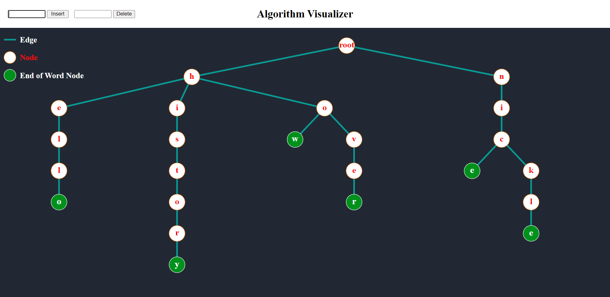
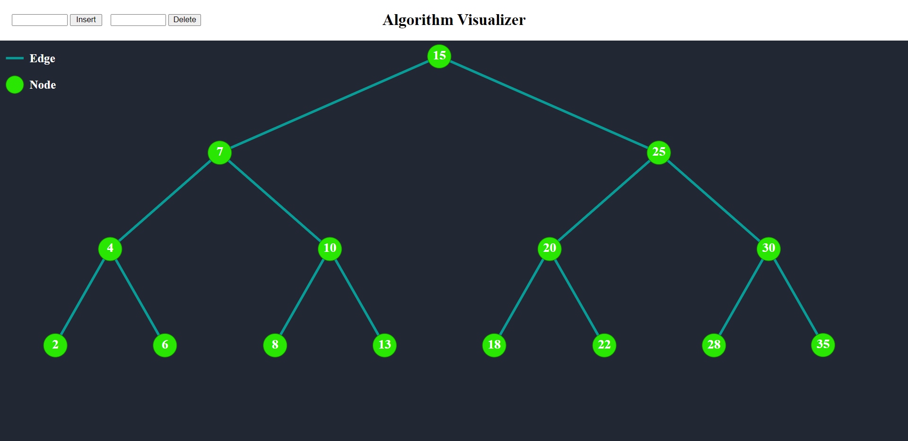
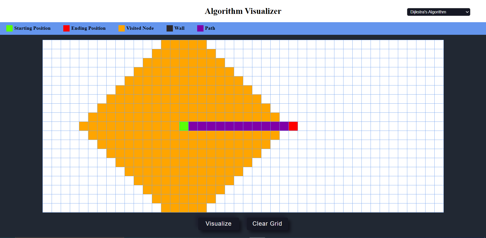

# Algorithm Visualizer

## Group members:
19BCE270 (Harshil Tagadiya)

19BCE273 (Tilak Tejani)

19BCE275 (Sachin Thadoda)

 

## Visit Algorithm Visualizer
https://harshil-270.github.io/ADS-Assignment/

<h3>Trie</h3>
Insert / Delete Word.

  

<h3>Binary Search Tree</h3>
Insert / Delete Number.

  

<h3>Graph Algorithms</h3>
<ul> 
  <li>Dijkstra's algorithm</li>
  <li>A* Search algorithm</li>
  <li>BFS(Breadth first search)</li>
  <li>DFS(Depth first search)</li>
</ul>

 
  

